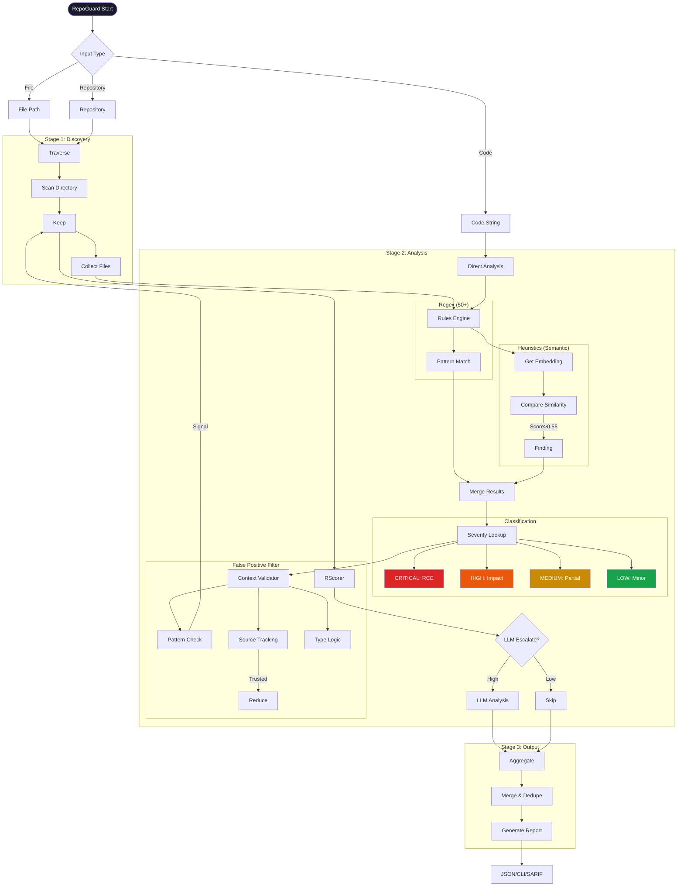

# RepoGuard - Process Flow

## Setup (Conda)

```bash
cd Group-6
conda env create -f environment.yml
conda activate group6
```



## Pipeline Summary

### Stage 1: File Discovery
- Traverse repository
- Filter ignore patterns (node_modules, .git, etc.)
- Collect code files (.py, .js, .php, etc.)

### Stage 2: Multi-Stage Analysis

**2a. Rules Engine** (Deterministic)
- 10-15 regex patterns
- Fast, precise detection

**2b. Heuristic Analyzer** (Semantic)
- 50+ regex patterns
- 60+ semantic patterns with CodeBERT/MiniLM
- Similarity scoring

**2c. Severity Classification**
- CRITICAL: Direct RCE, credentials exposed
- HIGH: SQLi, command injection, path traversal
- MEDIUM: XSS, weak crypto, IDOR
- LOW: Debug mode, info disclosure
- POTENTIAL: Needs manual review

**2d. Context Validation** (False Positive Filter)
- Check vulnerability signals
- Track data source (user vs trusted)
- Type-specific logic

**2e. Risk Scoring**
- Embedding similarity
- Keyword boosting

**2f. LLM Analysis** (Optional)
- Only for high-risk findings
- Explanations and fix suggestions

### Stage 3: Aggregation & Output
- Merge findings from all stages
- Deduplicate by line/type
- Sort by severity
- Output: JSON, CLI, SARIF